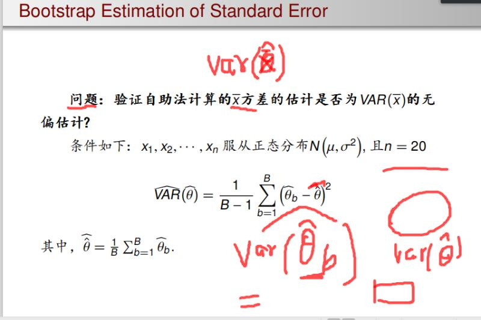
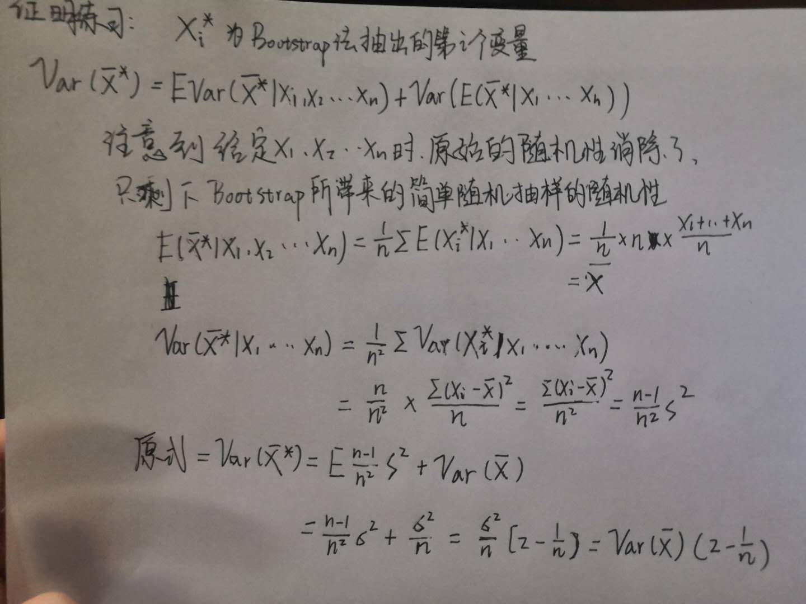

苏锦华 2017201629

# 题目要求



# 理论证明

为了加深印象，复现一下理论证明，发现理论上bootstrap均值估计量的方差要大于平均法样本均值的抽样分布方差。这个验证与本题目没有直接关联，仅仅为了加深印象。



# 模拟验证

经过验证，发现bootstrap估计$E(\hat{VAR}(\bar{X^*}))$小于$VAR(\bar{X})$,说明是估计是有偏的，偏小。

```{r}
n<-20
N <- 1000
B <- 50
bootstrap_estimate<-NULL
sample_mean<-NULL
mu <- 3
sigma = 4
for (i in 1:N){
  X <- rnorm(n,mu,sigma)
  sample_mean[i] <- mean(X)
  tmp <- c()
  for(j in 1:B){
    tmp <- c(tmp,mean(sample(X,n,replace = T)))
  }
  bootstrap_estimate[i] <- (tmp - mean(tmp)) %*% (tmp - mean(tmp)) /(B-1)
}
c(sigma^2/n, mean(bootstrap_estimate), var(sample_mean),var(bootstrap_estimate))

```
