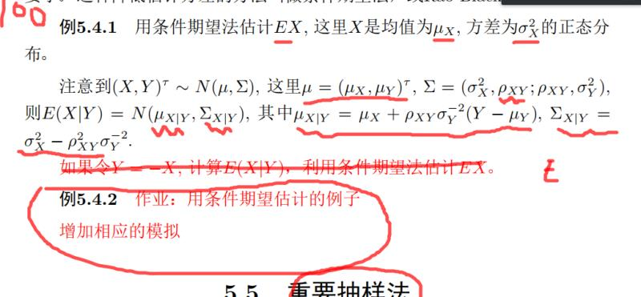

苏锦华 2017201620

# 作业要求



理论上知道E(x|y) = g(y)的正确表达式即可保证方差更小，但很多情况下并不知道x，y的均值方差信息，所以存在使用估计量来替代真值的可能，下面给出了多种估计。第二种为除了mu_y其他都需要估计，第三种为所有参数都不需要估计，发现第三种方差确实很小，但是实际应用场景中很难改进。

```{r}
library(MASS)
N <- 100
n <- 10
mu <- c(1,2)
sigma <- rbind(c(1,0.4),
               c(0.4,2))
estimate1 <- NULL
estimate2 <- NULL
estimate3 <- NULL
estimate4 <- NULL
estimate5 <- NULL
for( i in 1:N ){
  tmp <- mvrnorm(n = n, mu = mu, Sigma = sigma) 
  x <- tmp[,1]
  y <- tmp[,2]
  estimate1[i] <- mean(x)
  rho_ = ((x - mean(x)) %*% (y - mean(y)))[1,1] / n
  sigma_ = ((y - mean(y)) %*% (y - mean(y)))[1,1] / n
  estimate2[i] <- mean(mean(x) + rho_ / sigma_ * (y - 2))
  estimate3[i] <- mean(1 + 0.4 / 2 * (y - 2))
  estimate4[i] <- mean(mean(x) + 0.4 / 2 * (y - 2))
  estimate5[i] <- mean(mean(x) + rho_ / 2 * (y - 2))
}
c(mean(estimate1),mean(estimate2),mean(estimate3),mean(estimate4),mean(estimate5))
c(var(estimate1),var(estimate2),var(estimate3),var(estimate4),var(estimate5))
```

